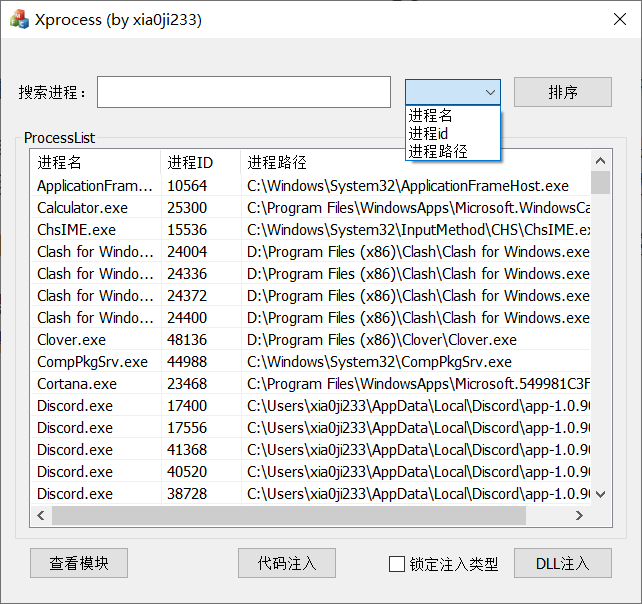
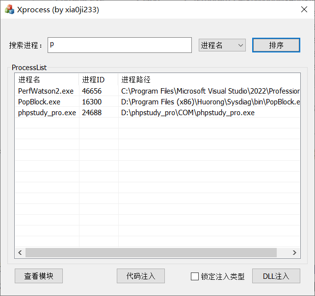
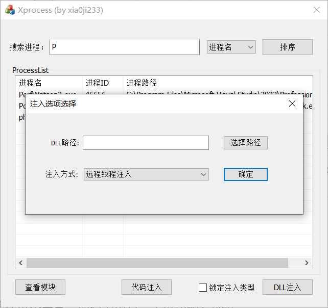
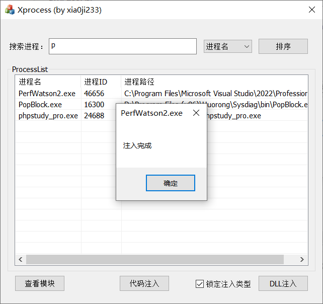

## Xprocess

Xprocess 是一个注入器项目，目前仅仅实现了**远程线程注入**，后续有需要可以新增功能。

市面上其实已经有了很多各色各样的很成熟的注入器，但是自己有个需求依然是大部分注入器还没有实现的（当然这个实现起来很简单，并且也可能已经有实现了的只是我没有找到而已），那就是搜索功能。

那些注入器很多都差不多，需要在一大堆进程列表里面找到我要注入的进程（这是第一点），右键选择 dll 路径。

再就是往往我需要反复测试反复注入一个进程的情况（这是第二点），我的 dll 和进程一般是不变的，而我每次都需要很麻烦地重复那几个步骤，于是我花了点时间写了这个项目。

下面是模块功能介绍：

### 排序功能

进程列表只列出了三列，因此可以选择这三个关键字进行升序排序排列，这个纯属是顺带去做的。

### 搜索功能

我们需要最快地找到想要注入的项目，因此每次文本框改变都会根据文本框的内容搜索出符合要求的进程，并且进程名匹配是前缀且不区分大小写的匹配，不区分大小写会比较方便，前缀匹配是为了增加匹配速度。

### DLL注入

左下边两个按钮是摆设不用管，最右下角有一个按钮和复选框。

点击 DLL 注入可以唤出另一个窗口

里面可以供我们选择 DLL 路径和注入方式（目前只有远程线程注入）。点击确定可以直接对选定进程注入，关闭按钮可以取消本次注入，并且点击确定之后可以保留路径名称，此时我们可以选择勾选复选框。勾选之后会锁定 DLL 路径和注入方式，再次点击就会直接注入不会弹窗，更加方便了我们反复注入。

UPDATE:2023-1-22，新增结束任务功能。

本项目已在 github 上开源，欢迎提交 PR